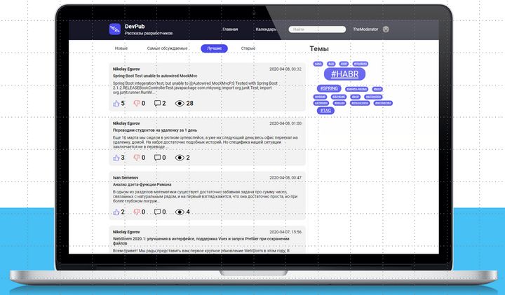
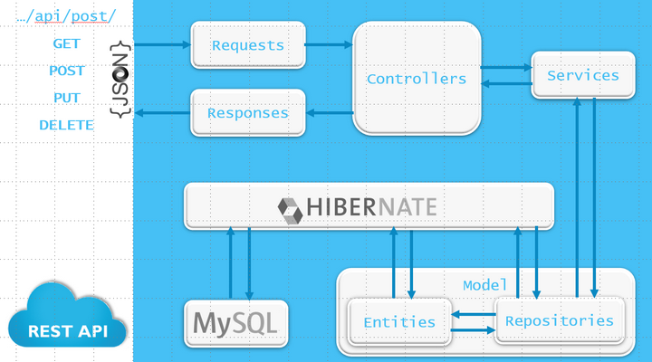
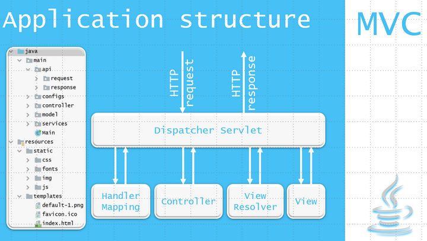
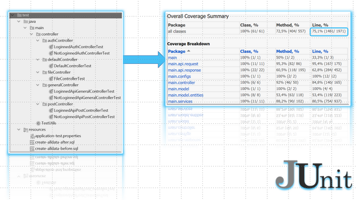

# Blog Engine Backend

            

The final work at Skillbох's course "Java-developer".

Docker command to start mysql in docker 
`docker run --name mysql8 -p 3306:3306 -e MYSQL_ROOT_PASSWORD=mypassword -e MYSQL_PASSWORD=mypassword -e MYSQL_DATABASE=testblogdb -e MYSQL_USER=blogadmin  -v ~/data/docker/volumes/mysql8:/var/lib/mysql -d mysql:8`

Java-based backend for a blog.

## Main technologies:
* Java11
* Apache Maven
* Spring Framework (Using Spring Boot project)
* MySQL8
* Git
* JUnit4

## Additional features:
* Hibernate
* Cage (CAptcha GEnerator)
* Jakarta Mail
* Jsoup library
* Lombok project
* Logback
* FasterXML Jackson
* SnakeYAML

Application is RESTful.

Designed with pattern MVC.

Code covered by tests for 75% lines.

